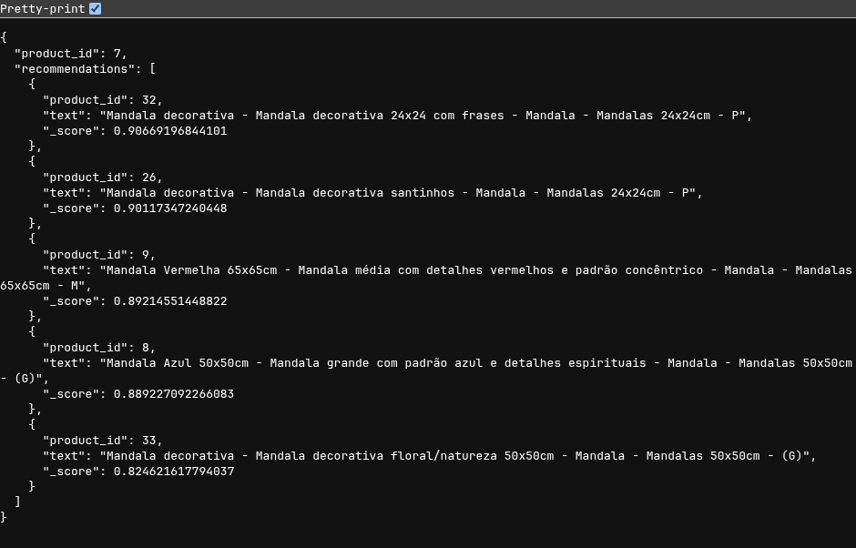
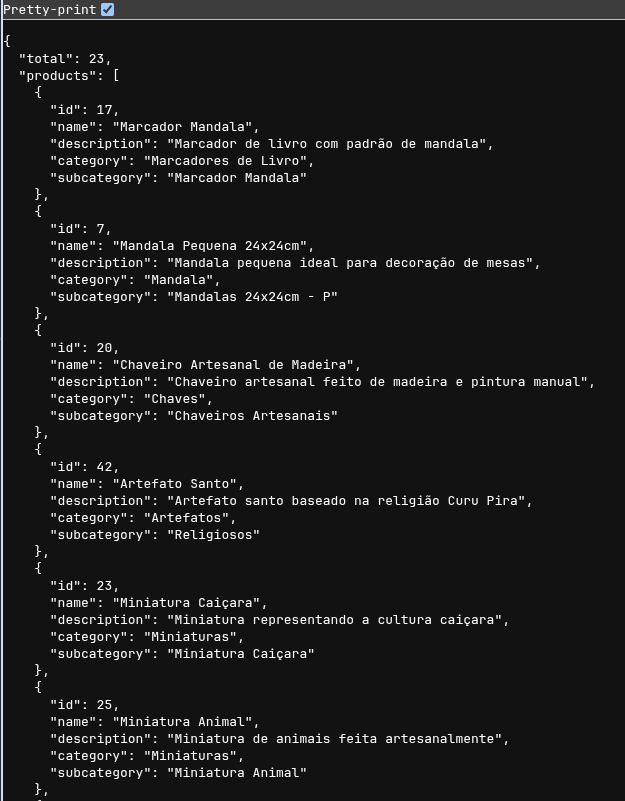

# Benucci Artes – Aplicativo Mobile + API de Recomendação de Produtos

  

O **Benucci Artes** é um aplicativo mobile desenvolvido em **React Native**, com backend em **Spring Boot** e banco de dados relacional. O objetivo da plataforma é conectar artesãos e clientes, ampliando a visibilidade de produtos artesanais por meio de uma experiência digital moderna, simples e eficiente.

Além do fluxo de e-commerce tradicional (cadastro de produtos, categorias, carrinho e compras), o projeto também utiliza uma **API própria de Recomendação de Produtos**, desenvolvida em Python, baseada em embeddings e cálculos vetorizados de similaridade.
  

---

# 1. Arquitetura do Projeto

O sistema é composto por três camadas principais:

1. **Aplicativo Mobile (React Native)**

Interface utilizada por clientes e artesãos para navegação, visualização e compra.

 https://github.com/DiegoPereira100/benucci-artesanato-front

2. **Backend Principal (Spring Boot)**

Gerencia autenticação, produtos, categorias, usuários, compras e integrações.

**URL da API em produção:**

https://benucci-artesanato.onrender.com/swagger-ui/index.html#

**Repositório da API:**

https://github.com/GlhermePereira/Benucci-Artesanato

3. **API de Recomendação (Python + FastAPI)**

Serviço independente para cálculo de similaridade entre produtos utilizando ML leve.

Essa API é um **serviço interno**, acessado exclusivamente pelo front-end.

---

# 2. Integração com a API de Recomendação de Produtos

A plataforma integra uma API dedicada para gerar recomendações automáticas de itens similares. A API utiliza embeddings, cache híbrido e filtragem por categoria para entregar respostas rápidas e relevantes.

Esse serviço não é destinado a execução local por terceiros, pois depende de **variáveis sensíveis, modelos internos e infraestrutura privada**.


**URL da API em produção:**

https://api-ml-benucci.onrender.com/

**Repositório da API:**

https://github.com/GlhermePereira/api-ml-benucci

## Principais funcionalidades da API

- Recomendações com base na similaridade entre produtos.
- Apenas itens da **mesma categoria** são avaliados.
- Exclusão do produto original no retorno.
- Retorno dos **top 10 produtos mais similares**.

- Uso de:
- **Embeddings pré-calculados**
- **Cache em memória**
- **Persistência em banco/arquivo**
- **NumPy/Torch para cálculo vetorizado**

---
# 3. Como a API é utilizada pelo sistema

- O front-end realiza uma requisição ao endpoint de recomendações.
- A API recebe o product_id e category_id.
- Ela coleta dados relevantes, aplica os filtros, calcula a similaridade e retorna os resultados.
- O backend entrega ao aplicativo somente os produtos recomendados.

### Exemplo de chamada

```

GET /https://api-ml-benucci.onrender.com/recommend/7/2

```

  

### Exemplo de resposta

  

```

{
  "product_id": 7,
  "recommendations": [
    {
      "product_id": 32,
      "text": "Mandala decorativa - Mandala decorativa 24x24 com frases - Mandala - Mandalas 24x24cm - P",
      "_score": 0.90669196844101
    },
    {
      "product_id": 26,
      "text": "Mandala decorativa - Mandala decorativa santinhos - Mandala - Mandalas 24x24cm - P",
      "_score": 0.90117347240448
    },
    {
      "product_id": 9,
      "text": "Mandala Vermelha 65x65cm - Mandala média com detalhes vermelhos e padrão concêntrico - Mandala - Mandalas 65x65cm - M",
      "_score": 0.89214551448822
    },
    {
      "product_id": 8,
      "text": "Mandala Azul 50x50cm - Mandala grande com padrão azul e detalhes espirituais - Mandala - Mandalas 50x50cm - (G)",
      "_score": 0.889227092266083
    },
    {
      "product_id": 33,
      "text": "Mandala decorativa - Mandala decorativa floral/natureza 50x50cm - Mandala - Mandalas 50x50cm - (G)",
      "_score": 0.824621617794037
    }
  ]
}

```


---

# 5. Arquitetura da API (resumo técnico)

- **Validação de entrada:** verifica product_id, category_id e filtros.
- **Coleta de produtos relevantes:** busca itens da mesma categoria e remove o produto base.
- **Cache + Persistência de embeddings:**

	1. Consulta cache
	2. Consulta armazenamento
	3. Recalcula se necessário

- **Cálculo de similaridade:** distância de cosseno em batch (NumPy/Torch).
- **Resposta:** top 10 itens ordenados por similaridade.

---

# 6. Contribuição

Este repositório é aberto para consulta, melhorias de documentação e sugestões estruturais. Alterações no código-fonte dependem de autorização, devido à natureza privada do serviço.

---
# 7. Licença

Este projeto está licenciado sob a **MIT License**. Consulte o arquivo [License](LICENSE) para mais detalhes.

---
# 8. Demonstração
- Resposta rota GET /https://api-ml-benucci.onrender.com/recommend/7/2



--- 
- Resposta rota GET /https://api-ml-benucci.onrender.com/products



